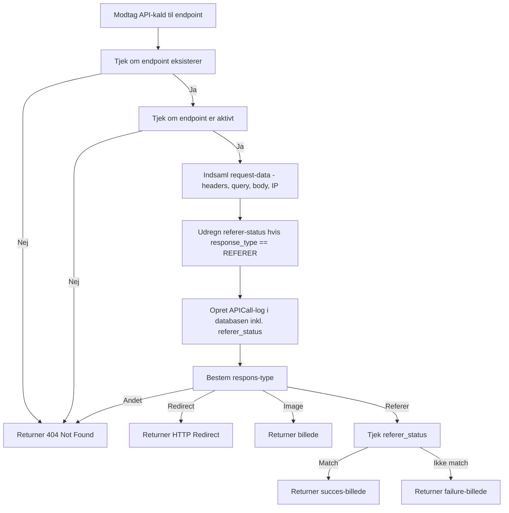

# Indholdsfortegnelse

- [Indledning](#indledning)
- [Problemformulering](#problemformulering)
- [Metode](#metode)
- [Forventet resultat](#forventet-resultat)
- [Afgrænsning](#afgr%C3%A6nsning)
- [Uddybning af Canary tokens](#uddybning-af-canary-tokens)
  - [Beskrivelse af canary tokens funktionaliteten](#beskrivelse-af-canary-tokens-funktionaliteten)
  - [Canary token endpoint](#canary-token-endpoint)
  - [Oprettelse af canary tokens](#oprettelse-af-canary-tokens)
  - [Fil auditering — Not found response](#fil-auditering--not-found-response)
  - [DOCX Token — Image response](#docx-token-image-response)
  - [Redirection response](#redirection-response)
  - [CSS Tokens — Referer respons](#css-tokens--referer-respons)
- [Sammenfatning](#sammenfatning)
- [Problemstillinger til drøftelse](#problemstillinger-til-dr%C3%B8ftelse)
- [Kilder og bilag](#kilder-og-bilag)

---

# Indledning

I takt med at organisationers IT-miljøer bliver mere komplekse, og mængden af følsomme data vokser, stiger også risikoen for uautoriseret adgang og kompromittering. Cyberangreb bliver stadigt mere sofistikerede, og samtidig udgør interne trusler også en reel risiko, da medarbejdere kan have utilsigtet adgang til ressourcer, de ikke bør tilgå.

For at kunne reagere hurtigere og mere præcist på brud på sikkerheden har organisationer behov for metoder, der kan opdage uautoriseret adgang i det øjeblik, den finder sted. Her kan en metode kaldet canary tokens spille en central rolle. Metoden har fået sit navn fra gamle kulminer, hvor der i gamle dage blev brugt kanariefugle som en form for detektionsværktøj, til at advare om giftige gasser i minen . Da kanariefuglene har mindre lunger end mennesker, vil fuglene falde om først i tilfælde af at der er giftige gasser, som en advarsel til minearbejderne om at de skal forlade stedet.

En canary token fungerer som en digital fælde, der kan placeres i systemer, filer eller netværk og udløser en alarm, når en uautoriseret person forsøger at tilgå det. På den måde kan organisationer opdage trusler tidligt og få et mere præcist billede af, hvordan ressourcer forsøges kompromitteret.

Et eksempel på et tænkt scenarie hvor canary tokens kan være relevante og som jeg vil undersøge nærmere i dette projekt, kan være dokumenter tilgængelige for en HR-afdeling. Disse dokumenter bør gemmes et sted på en fil-server, men adgangen til dokumenterne skal kontrolleres e.g. via en portal hvor de kun kan se relevante filer samt at adgangen til filerne logges, da der er tale om personfølsomme data ifm. CV’er og kontrakter. I sådan et tilfælde kunne man tænke sig at man placerer en canary token i form af en fil der uåbnet kunne ligne et CV eller en kontrakt. Dette dokument skal så gemmes blandt de andre HR relevante filer på en fil-server hvor adgangen er kontrolleret. Hvis filen så bliver tilgået, vil vores centrale endpoint automatisk blive alarmeret.

Beskrevet således kan teorien om canary tokens sammenlignes med andre eksisterende monitorerings løsninger, såsom SIEM-løsninger der på tværs af en organisations netværk og systemer kan opsamle logs og analysere dem i realtid for at detektere kompromitering . Jeg vil i dette projekt undersøge nærmere om canary tokens har nogen karaktertræk for dens funktionalitet som man ikke får ved traditionelle SIEM-løsninger. 

---

# Problemformulering

Organisationer har ofte digitale ressourcer spredt på filer, hjemmesider og i deres IT-miljø, som de ikke ønskes bliver tilgået af uvedkommende, kopieret, eller på anden måde bliver håndteret på anden vis end oprindeligt tiltænkt. Det gør det svært at opdage uautoriseret adgang i realtid. 

Der findes i forvejen mange velkendte løsninger for detektering og alarmering i IT miljøer såsom SIEM løsninger, hvorved canary tokens virker som en mere niche løsning. Jeg vil derved med dette projekt undersøge anvendelsen af canary tokens som detektionsværktøj og udvikle et centralt endpoint, der samler og håndterer alarmer fra disse tokens, så IT-ansatte får et overblik over mulige kompromitteringer og vurdere hvilke styrker og svagheder canary tokens har fremfor mere tradtitionelle løsninger.

---

## Metode

Projektet gennemføres ved at udvikle et praktisk endpoint, som kan modtage og logge alarmer fra forskellige typer canary tokens. Tokens’ effektivitet testes gennem kontrollerede scenarier, hvor uautoriseret adgang simuleres.

---

## Forventet resultat

En fungerende prototype af et centraliseret canary-token endpoint, der kan registrere og logge advarsler fra flere typer tokens, samt en vurdering af tokens’ anvendelighed og begrænsninger i praksis. 

---

## Afgrænsning

Projektet vil som udgangspunkt ikke omfatte integration med organisationens eksisterende SIEM-løsning, da dette kræver godkendelse fra øvre ledelse. 

---

# Uddybning af Canary tokens

## Beskrivelse af canary tokens funktionaliteten

Teorien bag disse tokens er at de skal fungere som en form for snubletråd som alarmere så snart de aktiveres. Måden de skal aktiveres på er at en fil eller stump kode skal placeres et sted hvor det ikke er tiltænkt at nogen skal aktivere den, således at hvis den aktiveres, så ved at nogen har tilgået en del af ens system som ikke er tiltænkt.

Det er nødvendigvis ikke kun til for at fange ondsindede aktører som hackere, men også til at detektere om interne i organisationen har tildens til at tilgå ressourcer de ikke bør gøre. Det kan ligeledes være med til at detektere om man har et hul i ens sikkerhed, hvis eksempelvis at tokenen placeres et sted hvor organisationen i forvejen har taget foranstaltninger imod at almindelige brugere ikke bør kunne tilgå ressourcerne der.

Selve funktionaliteten bag canary tokens kræver to dele. Den ene del vil være et centraliseret endpoint som skal kunne modtage kald fra selve det man vil betegne som canary tokenen. Den anden del er canary tokenen som kan eksistere i mange former såsom filer, mapper, apps, hjemmesider, email adresser, stumper af kode, m.m. Tricket er blot at finde en metode hvorpå ens endpoint kan blive kaldt.

## Canary token endpointet

Der eksisterer allerede open source projekter, der stiller Canary Token endpoints til rådighed, såsom Knary . Dog findes der ingen bredt anerkendt eller veletablerede aktører inden for dette område, som man eksempelvis ser det med SIEM løsninger som Splunk  som blev opkøbt af Cisco i 2024. I forbindelse med dette projekt vil jeg derfor udvikle mit eget endpoint, der skal modtage og logge aktivitet fra klient-tokens. Dette vil samtidig give mulighed for at undersøge i detaljer, hvordan Canary Tokens fungerer i praksis.

I skrivende stund er projektet stadig som POC (red: Proof Of Concept), hvor dele af serveren som ikke relaterer sig til funktionen bag Canary Token princippet endnu ikke er fuldt udviklet, såsom login siden, brugeroprettelse, m.m.

Frameworket som endpointet er bygget på er Django som er python baseret. Årsagen til valget af Django er på baggrund af dens brede vifte af indbyggede funktionaliteter, såsom database håndtering via dens egen ORM og definering af database modeller i koden, hvorved Django selv kan migrere modellerne til databasen , om det så er den standard indbyggede sqlite database som er behjælpelig i et udviklingsmiljø, eller om det er en separat database, f.eks. postgres eller lignende. Django kan også serve frontenden som statiske filer direkte, såsom en html fil , og integreres nemt med Django’s REST framework til API’er, hvilket er kernen bag denne løsning. Desuden kommer Django med indbygget authentikation  (ikke implementeret i skrivende stund) og andre sikkerhedsfeatures (CSFR , input-validering ). Ikke mindst er Python det sprog jeg er mest ferm i, hvilket øger udviklingsprocessen for mit vedkommende.
Vedhæftet findes bilag 1  som er en detaljeret teknisk dokumentation af canary endpointet der vil modtage kald fra vores tokens.

---

### Backend

Hensigten med de tokens der konfigureres, er at de skal informere et centralt system om aktivitet. Det sker som regel via HTTP GET-forespørgsler. HTTP fungerer som den underlæggende protokol, som klienten og serveren kommunikerer via, samt at serveren kan returnere et svar til klienten.

GET er den metode, der anvendes via HTTP-protokollen til at anmode om information fra en server . Der findes dog også andre metoder såsom POST, PUT, m.fl. som beskrevet i tabellen nedenfor – hvorimod GET-forespørgslen udelukkende tillader at klienter modtager information, anvendes de andre metoder til at modificere eller oprette ny data på serveren. I dette projekt fokuseres der som udgangspunkt på GET-forespørgslen, da det udelukkende er den metode der bliver anvednt som kommunikation mellem klient-tokens og endpoint-serveren.

Kort om HTTP-metoder:
| Metode  | Formål                                          |
|---------|-------------------------------------------------|
| GET     | Hente data fra serveren                         |
| POST    | Oprette en ny ressource                         |
| PUT     | Erstatte en eksisterende ressource fuldstændigt |
| PATCH   | Delvist opdatere en eksisterende ressource      |
| DELETE  | Slette en ressource                             |

Den funktionelle del af endpointet er færdigudviklet, dog med mulighed for fremtidig udvidelse, hvilket indebærer registrering og navngivning af nye endpoints, med henbilk på at kunne kategorisere og logge klient aktivitet fra tokens, samt konfigurering af pre-udvalgte svar til GET-forespørgslerne. 
Hovedfunktionen bag endpointet er at den skal modtage kald fra de endpoints der registreres. Her tages der beslutninger ud for det modtagede kald, om hvorvidt det skal logges, samt hvilket svar der skal returneres til den token som har initieret kaldet.

- Hvis ikke der er oprettet et endpoint for den URL der bliver kaldt, bliver det ikke logget og der returneres 404, som beskriver at siden ikke eksisterer.
- Hvis endpointet eksisterer men ikke længere er aktivt, returner 404, uden at logge kaldet.
- Derefter skal alle kald logges.
- Herefter skal der returneres et svar, alt efter hvad der er registreret for det specifikke endpoint.
    - 404: Er den standard svar type vi returnere til klienter. Det er tiltænkt at skulle udnyttes, for at give et indtryk af at der ikke sker noget ved at kalde den URL, selvom aktiviten er blevet logget.
    - Redirect: Dette svar bruges til at viderstille dem som laver et kald til en anden hjemmeside.
    - Image: Returnerer et billede til token kaldet. På den måde kan URLen virke legitim og harmløs, ved at indsætte et billede via URL I e.g. Word dokumenter eller lignende.
    - Referer: Statussen er lidt speciel da den der tiltænk at skulle bruges ifm. CSS ved at indlejre et billede via en URL. Når en hjemmeside loader billedet vil der I forespørgslens header som standard være en ‘referer’  URL, som er URLen hvorfra at kaldet stammer fra. Her kan vi alarmere hvis URLen istedet for kommer fra en ukendt side, samt returnere forskellige billeder afhængig af om referer URLen er legitim eller ej

### Frontend

For dette projekt er frontenden ikke helt lige så vigtig som backend funktionaliteten, da det ikke er så relevant for emnet IT-sikkerhed. Frontenden kunne lige så vel være en CLI applikation, da det vigtige er selve modtagelse og håndtering af Canary Tokens kald, men for brugervenlighedens skyld har jeg oprettet en frontend i frameworket VUE.

Nedenfor er en kort beskrivelse for at fremme forståelsen af funktionalitet bag dette Canary Endpoint.

Frameworket VUE er brugt til at lave reaktive frontend applikationer.  Dette er ikke det første projekt jeg laver i VUE så jeg er allerede bekendt med det, hvilket er årsagen til at jeg har valgt at bruge det til dette projekt. Når man udvikler i VUE foregår det i en .VUE fil, som kombinerer både HTML, JavaScript og CSS, som sammen med VUE indbyggede funktioner gør det nemt at skabe avanceret, flot og dynamisk indhold på ens side, relativt nemt. Fordelen ved VUE er at man kan dele sit projekt op i komponenter hvilket giver en god struktur til ens projekt, og muligheden for nemt at genbruge komponenter flere steder.

Dertil gør projektet også brug af en stylings komponent kaldet DaisyUI der bygger på tailwindsCSS, der har til funktionalitet at præfabrikere ens styling så man ikke selv skal tage stilling til en masse CSS . DaisyUI har mange tema man som standard kan vælge ud fra, men hvis man vil kan man også lave sit eget tema. Med DaisyUI kan man f.eks. deklarere som en klasse at objektet skal være en knap, og så klarer DaisyUI resten for at man har en flot knap. Som vist nedenfor kan bruge klasserne ”btn” som indikere at det skal ligne en knap, og ”btn-sm” for at indikere det skal være en lille knap.

**Indsæt billede**

Disse klasser vil så skabe en knap som vist nedenfor, som allerede er stylet I farver, former og dekorationer, alt efter hvorledes om musen holdes over knappen, ikke holdes over, eller om der klikkes på knappen, hvilket er med til at fremskynde udviklingsprocessen

**Indsæt billede**

Idéen bag Canary Endpointets funktion er at man skal starte med at logge ind for at få adgang til data over aktiviteten. Selvom det ikke kræver autentifikation for at kalde selve token API’et (som er beskrevet i tidligere afsnit om backend), så skal det det stadig kræve autentifikation for at kalde det interne API til databasen, for at få information om de kald som er blevet logget, samt hvilke endpoints der er tilgængelige. Da det indeholder information som ikke ønskes tilgængeligt for alle. Det ville kunne kompromittere konfidentialiteten af den data omhandlende de alarmerende logs, i tilfælde af at eksterne uden videre kunne lave en HTTP-get forespørgsel og modtage information om hvor mange endpoint adresser som er tilgængelige samt deres adresse. Da det giver indsigt i systemets struktur (endpoint URLs), vil det kunne afslører endpointets overvågningsmekanisme, som en angriber kan udnytte ved enten at undgå at alarmere disse endpoints, eller sende alt for mange alarmer uden at selve Canary Tokensne har været aktiveret.

Når først man er logget ind vil ens dashboard se ud som vist nedenfor. Der er to kolonner med information som er relevant for os. Til venstre ser vi menuen over de endpoints der er oprettet i systemet, der inkluderer information om hvorvidt at det er aktiveret eller deaktiveret, hvilken respons type, og mere. Til venstre ses kolonnen med vores log data der i oversigten inkluderer tidsstempel, hvilken IP kaldet stammer fra og Idet til det endpoint som der blev lavet et kald til.

**Indsæt billede**

For endpoint menuen er der en knap til at oprette nye endpoints og konfigurere dem som ønsket og alt efter hvilken responstype man ønsker. Dertil kan man også klikke på kort objektet for eksisterende endpoints for at kunne redigere deres konfiguration. I begge tilfælde vil man få en pop-up lignende den nedenfor.

**Indsæt billede**

Ud over at det kræver authentifikation for at få adgang til dashboardet, kunne det også være relevant at inkludere authorization i form af bruger-rettigheder i systemet. Det bør nødvendigvis ikke være alle som har adgang til at oprette nye endpoints. Det er i nuværende stund ikke implementeret, men vil være en idé til fremtiden.
Kolonnen over API aktivitet er loggen for de kald der er lavet til Canary Token Endpointsene, hvilket også kan anses for alarmeringsoversigten, da irrelevante kald ikke vil blive vist i denne oversigt. Klikker man på en af alarmerne, vil objektet udvide sig og vise mere detaljeret information opsnappet, herunder user_agent, payload,  headers med logs (i tilfælde hvor det er muligt), og mere.

---

## Oprettelse af canary tokens

Disse tokens kan eksistere i mange former, det er næsten kun fantasien der sætter grænser, da man skal finde på en metode på hvorledes man kan få utilsigtet aktivitet til at lave en GET-forespørgelse til Endpointet.

Min første idé til en token er omhandlede vores HR-system. Mere præcist, de fortrolige dokumenter som HR-personalet arbejder med, såsom CVer, jobansøgninger, kontrakter og andet relevant såsom sygdoms dokumentation, da det i den grad er personfølsomme oplysninger. Det program vores HR-ansatte benytter sig af, tilgår de via en webapp egenudviklet af organisationen. I den webapp er der i forvejen sat sikkerhedsforanstaltninger op. Brugerne tilgår nemlig ikke de gemte dokumenter direkte på filserveren, men i stedet via frontenden på serveren, hvor de logger ind med deres egen konto som skal have specifikke rettigheder for overhovedet at kunne tilgå HR systemet og derudover yderligere rettigheder for at kunne tilgå de personfølsomme dokumenter via HR-systemet. Brugerne er begrænset til kun at kunne tilgå dokumenter for ansatte inden for deres ansvarsområde, som så bliver dokument aktivitet logget. Da dokumenterne bliver tilgået via denne webapp, har brugerne heller ej direkte adgang til filerne på serveren.

På server niveau hvor de personfølsomme filer er lageret, er adgangen til dem også begrænset, så det som udgangspunkt kun er service-kontoen som hoster webappen der kan tilgå disse dokumenter. Dog med undtagelse for IT-personale som kan få midlertidigt rettigheder til det ifm. test, vedligehold og yderligere udvikling af programmet. 

Det er ikke utænkeligt at der findes en sårbarhed i webappen som muliggør adgang til disse dokumenter. Men truslen er ikke kun udefra kommende ondsindede aktører, men kan i et tænkt scenarie også være en intern ansat som kunne have en agenda for at tilgå disse dokumenter.

I sådan et tilfælde kunne det være hensigtsmæssigt at have en Canary Token lignenrde en legitim fil, f.eks. en kontrakt, der lå blandt de andre dokumenter men som HR-systemet så aldrig skulle tilgå. Hvis denne token fil bliver tilgået, skal den sende en GET-forespørgsel til endpointet for at alarmere om

---

### Fil auditering — Not found response

Det er muligt at auditere tilgang til disse potentielt personfølsomme filer, hvilket var min første ide til overvågning og alarmering som en form for canary token. For at fremvise denne mulighed har jeg opstillet en Windows Server 2025 virtuel maskine.

I denne server har jeg lavet en mappe i C drevet kaldet ”HRFolder”. Heri er der tre filer. Hhv. RealCV01.txt, RealCV02.txt og FakeCV01.txt – Disse filer skal for eksemplets skyld repræsentere de personfølsomme dokumnter som organisation gemmer men kun HR-personale skal have adgang til.

Dernæst er der to trin der skal til for at aktivere selve auditering af filerne.
- **1.** Man skal aktivere politikken for auditering for at serveren tager stilling til auditerings regler
    - Dette kan gøres enten lokalt på den enkelte maskine eller via ens active directory for at have central kontrol over flere servere.
    - **Indsæt billede**
- **2.** Dernæst skal mappen/filen have registreret en auditerings regel. Det kan man gøre ved at højre klikke på filen/mappen -> Properties -> Security -> Advanced -> Auditing
    - Inde i den menu kan man oprette auditeringsreglen. Her har jeg valgt at gruppen ”Everyone” skal auditeres, samt alle typer af interaktion.
    - **Indsæt billede**

Når disse to indstillinger er konfigureret, så vil Windows registrere et event i Event Vieweren, i tilfælde af at filen tilgås/kopieres/modificeres. Her vil også blive modtaget detaljeret information såsom UserName, Objektets (red. Filens) sti-navn, og endda hvilken process som filen blev åbnet i.

**Indsæt billede**

Denne registrering af auditering er nu ikke i sig selv en canary token. Det er blot indledende trin som er nødvendige for at kunne kalde vores endpoint, for at alarmere om at nogen har tilgået filen.

For at kalde vores endpoint har jeg valgt at lave et powershell script, som kontinuerligt kører i baggrunden. Scriptets formål er at tjekke om der er kommet nye events i eventvieweren med event ID’et 4663. Event ID’et 4663 henviser nemlig til aktivitet ifm. auditerings reglen – Mere præcist kaldes eventet "An attempt was made to access an object"

Scriptet laver lidt ekstra håndtering, for hvis en fil med auditering bliver åbnet kan jeg konstatere at der bliver oprettet fem events for samme aktivitet i eventvieweren. Så scriptet tjekker lige på dato og tid for oprettelse af eventsne og hvis de er oprettet i nøjagtigt samme sekund, registrere scriptet det kun som et event.

Dertil så sender scriptet en GET request til Canary Endpointet. I dette GET request inkluderer jeg eventID, tidsstempel og selve eventets besked med som headers. På den måde bliver den detaljerede information sendt med over til vores endpoint.

Headers i GET forespørgsler bruges oftest til at sende form for meta-data mellem klient og server, som definere e.g. hvilken type indhold der accepteres (Accept), browserens user-agent som definerer om det for eksempel er en Chrome, Firefox eller anden browser der evt. skulle besøge en side samt hvilken version det er, Authorization headers som for eksempel kan inkludere JWT-tokens som er en sikker måde at kommunikere at man f.eks. er successfuldt logget ind på en hjemmeside, m.m.

Der er ikke noget der begrænser en for selv at opkalde sin egen header og inkludere lige den info man vil, så her udnytter jeg den til at transportere information fra fil-serverens eventviewer og til Canary Endpointet.

***Eksempel af kald fra server via powershell script***

**Indsæt billede**

***Eksempel på modtaget kald inkl. info fra server i Canary Endpointet***

**Indsæt billede**

---

### DOCX Token — Image response

Indlejring af billede i Word (IncludePicture i Header & Footer) peger på canary-endpointet. Når dokumentet åbnes, loades billedet og endpointet logger IP, tid og user-agent. Denne metode virker også hvis filen kopieres til andre maskiner med internetforbindelse.

**Indsæt billede**

Her er det så anbefalelsesværdigt at konfigurere URL i Canary Endpointet med ”Response Type” som værende ”Image”. Så vil den nemlig returnere et billede i word-dokumentet hos klienten der åbner filen, i stedet for en ”404 not found” placeholder hvor billedefilen ellers skulle være placeret i word dokumentet.

Når dokumentet så åbnes, vil man i Canary Endpoint dashboardet kunne se at der er blevet logget aktivitet. Her kan man se tidspunkt for aktiviteten samt hvilken IP-adresse aktiviteten stammer fra. Det er desværre de mest brugbare informationer der kan inkluderes da der ikke kan indlejres scripts som i auditeringsprocessen der opsamler yderligere information fra eventvieweren. Det er muligt at indlejre makro’er i word dokumenter som potentielt kunne give mere information, dog med den komplikation at der vil blive vist en advarsel i Word når dokumentet åbnes.

**Indsæt billede**

Det smarte med denne løsning er at selv hvis filen skulle ende med at blive kopieret eller på anden vis overføres til en maskine der nødvendigvis ikke har auditering aktiveret, så vil der alligevel blive sendt en forespørgsel til endpointet hvis dokumentet åbnes, så længe at enheden har internetforbindelse.

### Redirection response

En metode man også kan udnytte med sine canary tokens er viderestilling. Princippet vil være at placere et link i en lokation som ikke bør tilgåes af andre. Det kan for f.eks. være i en mappe navngivet ”Økonomi” hvori der er en fil med dette link og evt. anden tekst som kunne indikere autentifikations oplysninger. Andre mapper, filer eller lokationer er også mulige, det handler blot om at få linket til at se eftertragtet ud.

Proceduren er derefter enkel. Der skal oprettes et endpoint i canary endpoint systemet, af typen ”redirect”.  Når vedkommende så besøger vores redirect endpoint URL, vil der I øjeblikket de forbinder til endpointet registreres en log for besøget som indikerer uønsket aktivitet, samt opsamle information såsom IP-adresse fra maskinen der har besøgt URLen, tidsstempel og browserens useragent, m.m.

**Indsæt billede af flow diagram**

### CSS Tokens - Referer respons

***Skriv mere om dette punkt***

---

# Sammenfatning

***Skriv mere om dette afsnit***

---

# Problemstillinger til drøftelse

***Skriv mere om dette afsnit***

---