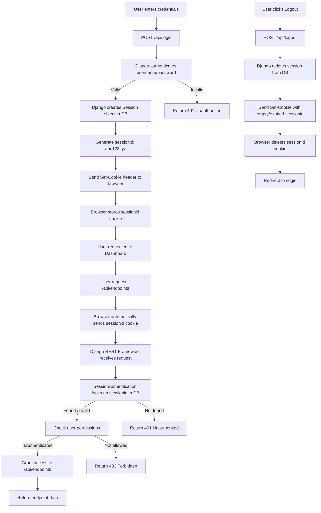

## Projektbeskrivelse: Canary Endpoint
### Overblik

Dette projekt består af en Django backend og en Vue frontend, der tilsammen udgør et system til overvågning og logning af API-kald til såkaldte "canary endpoints". Systemet kan bruges til at detektere uautoriseret adgang, test af sikkerhed eller som en del af et audit-setup.

Projektet er stadig i en alpha-fase og er i nuværende version ikke klar til produktion.

---

### Backend (Django)
#### Arkitektur

- **Framework:** Django, fungerende som backend or hoster frontend som flad fil
- **Database:** SQLite
    >*SQLite databasen er en integreret løsning i Django. Den skal udskiftes med en seperat database hvis projektet skal gå live, da der er risiko for tab af data ved app opdateringer ved brug af django's indbyggede SQLite database.*
- **API:** RESTful, implementeret med Django REST Framework
- **Modeller:**
    - **Endpoint:** Beskriver et canary endpoint, inkl. sti beskrivelse, aktiv-status og respons-type (fx billede, redirect, referer-check).
    - **APICall:** Logger hvert API-kald, inkl. tid, IP, headers, payload, user agent, referer-status m.m.

#### Funktionalitet
- **Oprettelse og redigering af endpoints:** Endpoints kan oprettes med forskellige respons-typer, fx billede, redirect eller referer-check (hvor succes/failure billede returneres afhængigt af referer-header).
- **Logning af API-kald:** Alle kald til endpoints logges automatisk, inkl. relevante metadata.
- **Responslogik:** Backend returnerer dynamisk billede, redirect eller 404 afhængigt af endpoint-konfiguration og request-data.
- **Admin-dashboard:** CRUD for endpoints og visning af loggede API-kald.

---

### Frontend (Vue)
#### Arkitektur
- **Framework:** Vue 3
- **UI:** DaisyUI + TailwindCSS for moderne og responsivt design
- **Routing:** Vue Router

### Funktionalitet
- **Dashboard:** Oversigt over endpoints og seneste API-kald.
- **Opret/rediger endpoint:** Modal-formularer med dynamiske felter afhængigt af valgt respons-type (fx upload af billeder til referer-check).
- **Tema-skifter:** Brugeren kan skifte mellem lys og mørk tema, som gemmes i localStorage og følger systemets præference som standard.
- **Brugerhåndtering:** Login/logout og oprettelse af brugere. ***(Endnu ikke implementeret korrekt)***

---

### Integration 
- **Kommunikation:** 
    - Frontend kommunikerer med backend via REST API og validerer authentifikation med JWT token.
    - Tokens kommunikerer med isoleret REST API der ikke kræver authentifikation.
- **Fil-upload:** Billeder kan uploades til backend, ifm. repsons typerne for specifikke endpoints.

### Brugsscenarier
- **Sikkerhedstest:** Placer canary endpoints i kode eller dokumenter for at opdage uautoriseret adgang.
- **Audit:** Log alle forsøg på adgang til følsomme ressourcer.
- **Demo:** Vis hvordan systemet kan bruges til at overvåge og reagere på API-kald.

---


### Teknisk dokumentation

- **Kildekode:** Struktureret i separate apps *(fx receiver, api, ui)* for modularitet og overskuelighed.
- **Migrations:** Alle modelændringer håndteres via Django migrations, fx tilføjelse af nye tabeller eller felter i databasen.
- **API:** REST API’et er dokumenteret via serializers og viewsets i Django REST Framework, hvilket gør det nemt at udvide og integrere med andre systemer.
- **Logging:** Alle API-kald logges med relevante metadata, herunder IP-adresse, headers, payload, user agent og evt. referer-status.

---

#### Django Session Authentication Cookie



#### Processen i receiver API'et (`receiver/views.py`)

Når et eksternt system eller en bruger foretager et kald til et canary endpoint, håndteres dette af funktionen `receive_api_call`, som er det endpoint som er udadvendt uden authentifikation, da det skal kunne modtage kald fra alle token. Processen er som følger:

```python
# Uddrag fra receiver/views.py
def receive_api_call(request, path):
    try:
        endpoint = Endpoint.objects.get(path=path)
    except Endpoint.DoesNotExist:
        endpoint = None

    if endpoint and not endpoint.is_active:
        return HttpResponseNotFound()

    # Indsamling af request-data
    payload = request.POST.dict() if request.method == "POST" else request.GET.dict()
    method = request.method
    headers = dict(request.headers)
    query_params = request.GET.dict()
    body = request.body.decode('utf-8', errors='replace') if request.body else None
    user_agent = request.headers.get('User-Agent', '')

    # Referer-check logik
    referer_status = None
    if endpoint and endpoint.response_type == Endpoint.RESPONSE_REFERER:
        referer = request.META.get('HTTP_REFERER', '')
        # ...normalisering og sammenligning...
        referer_status = normalized_expected and normalized_referer == normalized_expected

    # Logning af API-kald
    APICall.objects.create(
        endpoint=endpoint,
        payload=payload,
        remote_ip=request.META.get('REMOTE_ADDR'),
        method=method,
        headers=headers,
        query_params=query_params,
        body=body,
        user_agent=user_agent,
        referer_status=referer_status,
    )

    # Returnér respons baseret på endpoint-konfiguration
    if not endpoint:
        return HttpResponseNotFound()
    if endpoint.response_type == Endpoint.RESPONSE_REDIRECT and endpoint.response_redirect_url:
        return HttpResponseRedirect(endpoint.response_redirect_url)
    if endpoint.response_type == Endpoint.RESPONSE_IMAGE and endpoint.response_image:
        return FileResponse(endpoint.response_image)
    if endpoint.response_type == Endpoint.RESPONSE_REFERER:
        if referer_status and endpoint.response_image_referer_success:
            return FileResponse(endpoint.response_image_referer_success)
        elif endpoint.response_image_referer_failure:
            return FileResponse(endpoint.response_image_referer_failure)
    return HttpResponseNotFound()
```
Beskrevet i workflow diagrammet nedenfor, så tages der nogen beslutninger ud for det modtagede kald.
- Hvis ikke der er oprettet et endpoint for den URL der bliver kaldt, bliver det ikke logget og der returneres 404, som beskriver at siden ikke eksister.
- Hvis endpointet eksisterer men ikke længere er aktivt, returner 404, uden at logge kaldet.
- Derefter skal alle kald logges.
- Herefter skal der returneres et svar, alt efter hvad der er registreret for det specifikke endpoint.
    - **404:** er den standard svar type vi returnere til klienter. Det er tiltænkt at skulle udnyttes, for at give et indtryk af at der ikke sker noget ved at kalde den URL.
    - **Redirect:** Dette svar bruges til at viderstille dem som laver et kald til en anden hjemmeside.
    - **Image:** Returnerer et billede til token kaldet. På den måde kan URL virke legitim ved at indsætte et billede via URL i e.g. Word dokumenter, PDF, eller lignende.
    - **Referer:** Statussen er lidt specielt og er tiltænkt at skulle bruges ifm. CSS ved at indlejre et billede via en URL. Når en hjemmeside loader billedet vil der i forespørgslens header som standard være *'referer'* URL, som er URLen fra den hjemmeside at kaldet blev lavet fra. Her kan vi alarmere hvis URLen istedet for kommer fra en ukendt side, samt returnere forskellige billeder afhængig af om referer URLen er legitim eller ej. 

<div style="background-color: white; border: black; padding: 10px;">
    
</div>

#### Databasebeskrivelse (`receiver/model.py`)

Projektet benytter to centrale modeller.

Den ene model omhandler de Endpoints der kan opstilles til at kunne modtage kald.

```Python
class Endpoint(models.Model):
    name = models.CharField(max_length=100)
    path = models.CharField(max_length=100, unique=True)
    description = models.TextField(blank=True)
    created_at = models.DateTimeField(auto_now_add=True)
    updated_at = models.DateTimeField(auto_now=True)
    is_active = models.BooleanField(default=True)
    token = models.CharField(max_length=64, blank=True, null=True)
    response_type = models.CharField(max_length=20, choices=RESPONSE_CHOICES, default=RESPONSE_NOT_FOUND)
    response_redirect_url = models.CharField(max_length=1000, blank=True, null=True)
    response_image = models.ImageField(upload_to='endpoint_images/', blank=True, null=True)
    response_image_referer_success = models.ImageField(upload_to='endpoint_images/', blank=True, null=True)
    response_image_referer_failure = models.ImageField(upload_to='endpoint_images/', blank=True, null=True)
    response_referer_url = models.CharField(max_length=1000, blank=True, null=True)
```

Og den anden model omhandler lagring af de modtagede kald til endpoint, så vi har et sted at gemme vores logs.

```Python
class APICall(models.Model):
    endpoint = models.ForeignKey(Endpoint, on_delete=models.CASCADE, null=True, blank=True)
    timestamp = models.DateTimeField(auto_now_add=True)
    payload = models.JSONField()
    remote_ip = models.GenericIPAddressField(null=True, blank=True)
    method = models.CharField(max_length=10)
    headers = models.JSONField(blank=True, null=True)
    query_params = models.JSONField(blank=True, null=True)
    body = models.TextField(blank=True, null=True)
    user_agent = models.CharField(max_length=256, blank=True, null=True)
    referer_status = models.BooleanField(default=True, null=True)
```

Disse modeller beskriver den database struktur som applikationen skal benytte. Fordelen ved at beskrive det her i koden, er at Django frameworket kan sørge for at de tabeller eksistere i databasen med korrekt datastruktur, både i udviklingsmiløjer med en SQLite database, men også når projektet skal forbindes til en seperat database.


#### Det interne API (`api/views.py`)

Det interne API eksponerer data til frontend og evt. andre systemer via REST. Det er tiltænkt at disse kald skal være låst ned i den forstand at det skal kræve session tokens som authentificeres i backenden at det er en legitim bruger der foretager kaldet. 

```Python
# Uddrag fra api/views.py

class EndpointViewSet(viewsets.ModelViewSet):
    queryset = Endpoint.objects.all().order_by('-created_at')
    serializer_class = EndpointSerializer
    parser_classes = (MultiPartParser, FormParser)

class APICallViewSet(viewsets.ReadOnlyModelViewSet):
    queryset = APICall.objects.exclude(referer_status=True, endpoint__response_type='REFERER').order_by('-timestamp')
    serializer_class = APICallSerializer
```

Den bruger Django frameworkets ORM *(Object-Relational Mapping)*, så der ikke er risiko for SQL-Injektion, til at hente data fra SQL databasen.

> For eksempel, så svarer følgende kode:
> ```Python 
> Endpoint.objects.all().order_by('-created_at')
>```
>Til denne traditionelle SQL forespørgsel:
>```Python
>SELECT * FROM endpoint ORDER BY created_at DESC;
>```


### Udvidelsesmuligheder/planer
- **Webhook-support:** Mulighed for at endpoints kan trigge eksterne webhooks.
- **Avanceret filtrering:** Søgning og filtrering af API-kald i dashboard.
- **Signals:** Signaler som broadcastes til authentificerede sessioner, der opdaterer API logs live uden at genindlæse siden, hvis der er sket nye kald.
- **Notifikationer:** Push eller e-mail ved mistænkelige kald.
- **Alarmering & monitorering:** Mulighed for integration overvågningsværktøjer som SIEM eller XDR, eksemplvis Splunk eller Defender XDR.
- **Tests:** Unit tests for models og views.
- Flere HTTP respons-typer

